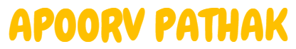

## Hello Everyonee, I am... 👋👋

<!--
**ApoorvPathak2003/ApoorvPathak2003** is a ✨ _special_ ✨ repository because its `README.md` (this file) appears on your GitHub profile.
Here are some ideas to get you started:
-->

- 🔭 I’m currently working on Data Science projects.
- 🌱 I’m currently learning Deep Learning, and Model Deployment.
- 👯 I’m looking to collaborate with someone on ML and Data Science projects.
- 🤔 I’m currently looking for an internship oppurtunity in the Data Science domain; I have previously worked in a company as a data scientist intern. 
- 💬 Ask me about ...
- 📫 How to reach me: apoorvgunjanpathak@gmail.com
- 😄 Pronouns: He/Him
- ⚡ Fun fact: Do you know why computer language's are difficult to understand? Because it was written by a woman named Ada Lovelace.

I am also interested in book reading and article writing. You can connect me on  Medium to read my latest articles.

You can also connect me via my  LinkedIn profile.
