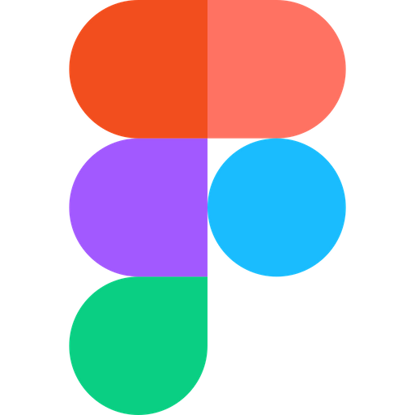

## Hello Geeks, I'm. APOORV PATHAK... 👋👋

<h3 align = 'center'>Software Engineer 💻</h3>

  

<!--
**ApoorvPathak2003/ApoorvPathak2003** is a ✨ _special_ ✨ repository because its `README.md` (this file) appears on your GitHub profile.
Here are some ideas to get you started:
-->
- 🧑🏽‍💼 SDE @Cognam Technologies Pvt. Ltd.
- 🧠 I'm currently working on **Java**, & **Spring Boot**.
- 🌱 I have experience of around 2 years as a **Software Developer** at **Cognam Technologies**, 3 months as a **Data Science Intern** at ***INNODATATICS*** & of 3 months as a **Business Analyst Intern** at ***Zoplar***.
- 📧 Email-ID: apoorvgunjanpathak@gmail.com
- ⚡ Fun Fact: Do you know why computer languages are difficult to understand? Because it was written by a woman named Ada Lovelace.

### Experience: [INNODATATICS](https://github.com/ApoorvPathak2003/ApoorvPathak2003/blob/main/INNODATATICS%20-%20Internship%20Experience%20Letter.pdf), [ZOPLAR](https://github.com/ApoorvPathak2003/ApoorvPathak2003/blob/main/ZOPLAR%20-%20Internship%20Experience%20Letter.pdf)

### Language & Tools:
                                                      

###  Connect Me:

  
                                
                      
                      
                      
                      
                      

