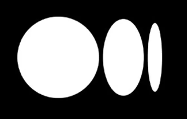

## Hello Everyonee, I'm. APOORV PATHAK... 👋👋

  

<!--
**ApoorvPathak2003/ApoorvPathak2003** is a ✨ _special_ ✨ repository because its `README.md` (this file) appears on your GitHub profile.
Here are some ideas to get you started:
-->

- 🔭 I’m currently working on Data Science projects.
- 🌱 I’m currently learning Deep Learning, and Model Deployment.
- 👯 I’m looking to collaborate with someone on ML and Data Science projects.
- 🤔 I’m currently looking for an internship oppurtunity in the Data Science domain; I have previously worked in a company as a data scientist intern. 
- 📫 Email: apoorvgunjanpathak@gmail.com
- 😄 Pronouns: He/Him
- ⚡ Fun fact: Do you know why computer language's are difficult to understand? Because it was written by a woman named Ada Lovelace.

### Know about my experience 😎: [Resume](https://github.com/ApoorvPathak2003/ApoorvPathak2003/blob/main/Apoorv%20Pathak%20-%20Data%20Scientist%20Intern.pdf)

### Language & Tools:
                                                     

###  Interests:
1. **Book Reading**(<a href = 'https://www.goodreads.com/user/show/164208181-apoorv-gunjan-pathak'>goodreads</a>)
2. **Article Writing**
3. **Gym**
4. **Music**

###  Connect Me:
1. Medium 
2. LinkedIn 
3. Quora 
4. Twitter 
5. Instagram 
6. Facebook 
